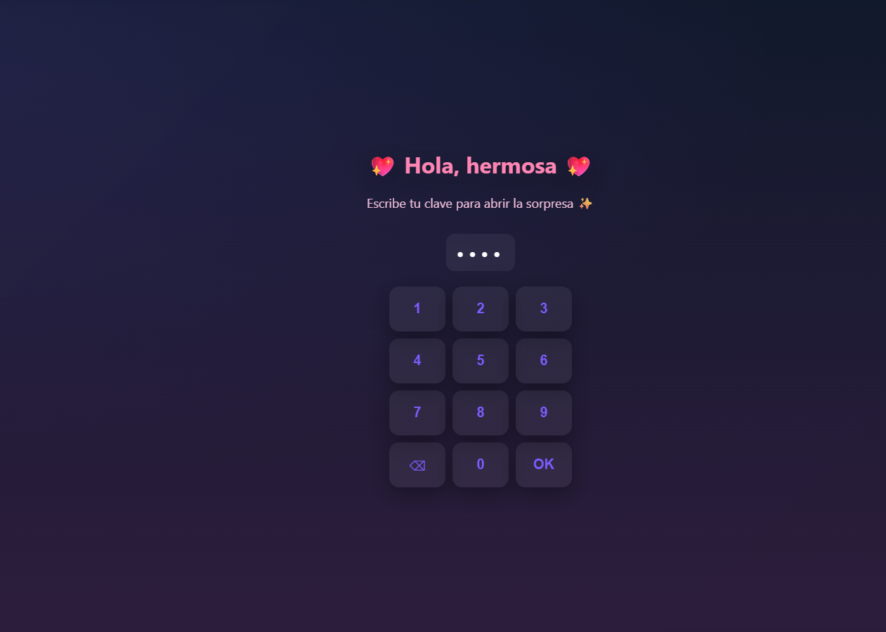

# 🎂 Birthday 3D Site

Una aplicación web interactiva y moderna para celebraciones de cumpleaños con gráficos 3D inmersivos.

<p align="center">
  
</p>

## 📋 Descripción

Este proyecto es una experiencia web única que combina React con gráficos 3D avanzados usando Three.js. Presenta múltiples pantallas interactivas para una experiencia de cumpleaños totalmente inmersiva y personalizada.

## 🎨 Características Principales

- **Gráficos 3D Interactivos**: Implementados con Three.js y React Three Fiber
- **Pantallas Múltiples**: Experiencia en múltiples niveles con diferentes contenidos
- **Animaciones Fluidas**: Transiciones suaves entre pantallas
- **Diseño Responsivo**: Compatible con diferentes dispositivos
- **Sistema de Desbloqueo**: Pantalla interactiva inicial

## 📁 Estructura del Proyecto

```
birthday-3d-site/
├── public/
│   └── index.html          # Archivo HTML principal
├── src/
│   ├── components/
│   │   ├── Model.js        # Modelos 3D
│   │   ├── Screen1.js      # Primera pantalla (inicio)
│   │   ├── Screen2.js      # Segunda pantalla
│   │   └── Screen3.js      # Tercera pantalla
│   ├── App.js              # Componente principal
│   ├── index.js            # Punto de entrada
│   └── styles.css          # Estilos globales
├── package.json            # Dependencias del proyecto
└── README.md              # Este archivo
```

## 🚀 Instalación y Uso

### Requisitos
- Node.js (v14 o superior)
- npm o yarn

### Pasos de Instalación

1. **Clonar el repositorio**
```bash
git clone <repository-url>
cd birthday-3d-site
```

2. **Instalar dependencias**
```bash
npm install
```

3. **Ejecutar en desarrollo**
```bash
npm start
```

4. **Compilar para producción**
```bash
npm build
```

## 🛠️ Tecnologías Utilizadas

- **React 18.2.0**: Librería de interfaz de usuario
- **Three.js 0.161.0**: Librería de gráficos 3D
- **@react-three/fiber 8.15.16**: Integración de Three.js con React
- **@react-three/drei 9.114.3**: Utilidades 3D para React Three
- **maath 0.10.6**: Librería de matemáticas para gráficos 3D
- **React Scripts 5.0.1**: Herramientas de construcción

## 🎮 Cómo Funciona

1. **Screen1**: Pantalla inicial interactiva con opción de desbloqueo
2. **Screen2**: Contenido principal de la celebración en 3D
3. **Screen3**: Pantalla adicional con efectos especiales

## 🌐 Navegación

La aplicación utiliza un sistema de estado para navegar entre pantallas:
- Comenzar en `Screen1`
- Al desbloquear, acceder a `Screen2`
- Continuar con la experiencia 3D

## 📦 Scripts Disponibles

```bash
npm start       # Inicia servidor de desarrollo (puerto 3000)
npm build       # Crea compilación optimizada para producción
npm test        # Ejecuta pruebas
npm eject       # Expone configuración (irreversible)
```

## 🎯 Requisitos del Navegador

- Navegador moderno con soporte WebGL
- Chrome, Firefox, Safari o Edge (versiones recientes)

## 💡 Notas de Desarrollo

- Todos los componentes 3D se encuentran en la carpeta `components/`
- Los estilos globales están en `styles.css`
- La gestión de estado se realiza en `App.js` con React Hooks

## 🤝 Contribución

Las contribuciones son bienvenidas. Para cambios significativos, abre un issue primero.

## 📄 Licencia

Este proyecto es privado y parte del portfolio de Kriptom.

---

⭐ Disfruta celebrando con esta experiencia interactiva 3D única.
